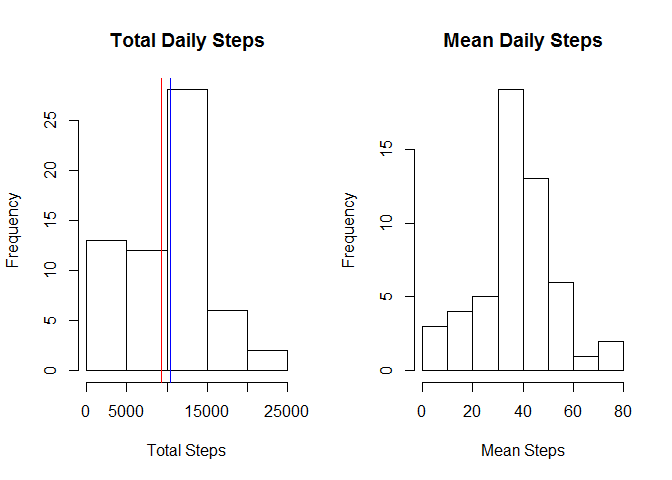
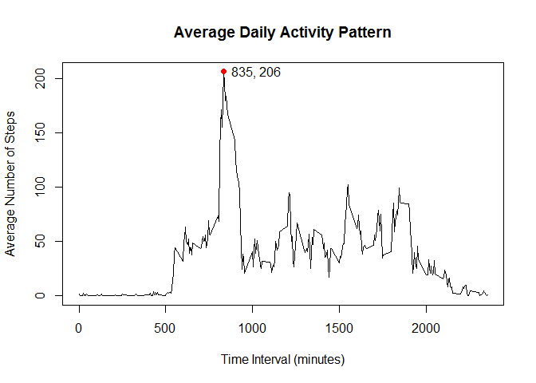
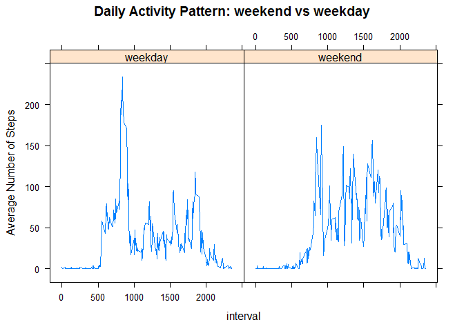
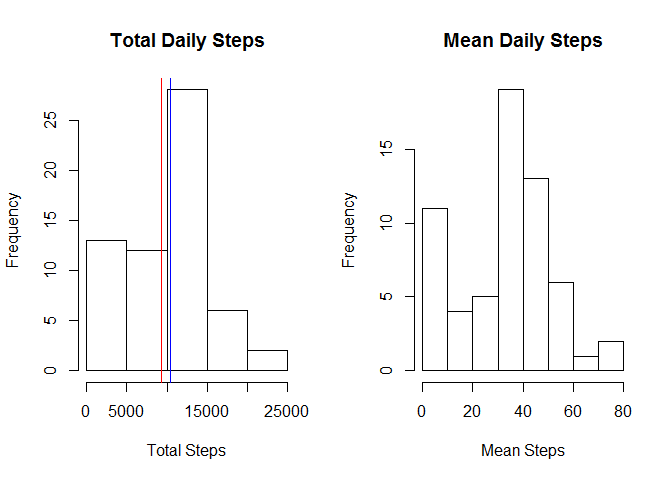
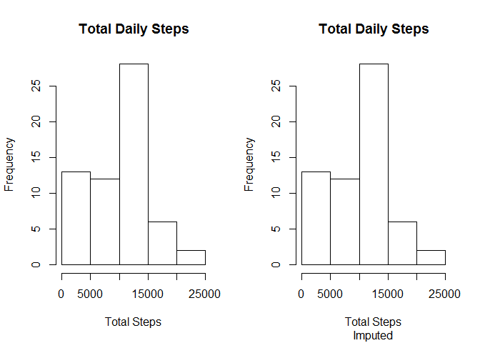
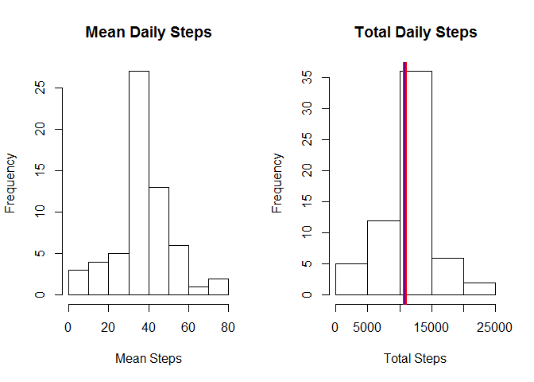
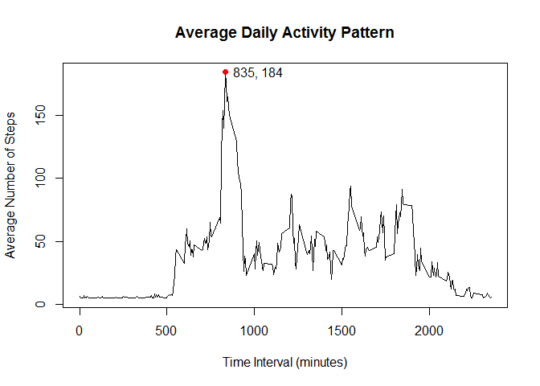
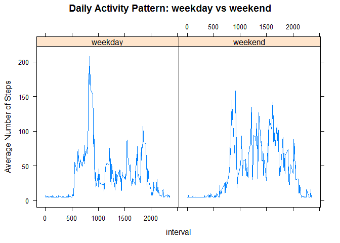

# Peer Assessment 1: Activity Monitoring
James Theobald  
January 4, 2016  

Introduction
============

Activity monitoring as the current trend in fitness trackers offers the perfect opportunity to practice exploratory analytic techniques in literate statistical programming. The file `activity.csv` provides information about `steps` taken over a period of time for which this report strives to elucidate activity patterns.  This report is submitted for partial fullfillment of the requirements of for Reproducible Research by Johns Hipkins University on Coursera.


Loading and Preprocessing the Data
===================================
The packages `dplyr` and `lattice` are required for this analysis

1. Download the data at <https://d396qusza40orc.cloudfront.net/repdata%2Fdata%2Factivity.zip>.


```r
temp <- tempfile()
download.file("https://d396qusza40orc.cloudfront.net/repdata%2Fdata%2Factivity.zip",temp)
unzip(temp)
unlink(temp)
rm(temp)
```


2. Load the data into R with `read.csv()`.  A comparison will be made between data including NA's and data imputing NA's, so two versions of the data are read into R. It is not necessary to create and save both versions of the data frame at once.  The `activity` data frame may be modified after all the initial analyses are done without imputation.


```r
activity <- read.csv("activity.csv")

activity.imp <- read.csv("activity.csv")
```

3. Determine the structure and characteristics of the data.


```r
names(activity)
```

```
## [1] "steps"    "date"     "interval"
```

```r
#dim(activity)
str(activity)
```

```
## 'data.frame':	17568 obs. of  3 variables:
##  $ steps   : int  NA NA NA NA NA NA NA NA NA NA ...
##  $ date    : Factor w/ 61 levels "2012-10-01","2012-10-02",..: 1 1 1 1 1 1 1 1 1 1 ...
##  $ interval: int  0 5 10 15 20 25 30 35 40 45 ...
```

```r
summary(activity)
```

```
##      steps                date          interval     
##  Min.   :  0.00   2012-10-01:  288   Min.   :   0.0  
##  1st Qu.:  0.00   2012-10-02:  288   1st Qu.: 588.8  
##  Median :  0.00   2012-10-03:  288   Median :1177.5  
##  Mean   : 37.38   2012-10-04:  288   Mean   :1177.5  
##  3rd Qu.: 12.00   2012-10-05:  288   3rd Qu.:1766.2  
##  Max.   :806.00   2012-10-06:  288   Max.   :2355.0  
##  NA's   :2304     (Other)   :15840
```

```r
#class(activity)
head(activity)
```

```
##   steps       date interval
## 1    NA 2012-10-01        0
## 2    NA 2012-10-01        5
## 3    NA 2012-10-01       10
## 4    NA 2012-10-01       15
## 5    NA 2012-10-01       20
## 6    NA 2012-10-01       25
```

```r
tail(activity)
```

```
##       steps       date interval
## 17563    NA 2012-11-30     2330
## 17564    NA 2012-11-30     2335
## 17565    NA 2012-11-30     2340
## 17566    NA 2012-11-30     2345
## 17567    NA 2012-11-30     2350
## 17568    NA 2012-11-30     2355
```

##Variables##

<https://class.coursera.org/repdata-032/human_grading/view/courses/975145/assessments/3/submissions>  

###Original Variables###
 * steps -- the number of steps taken in a 5-minute interval (missing values are coded as `NA`)  
 * date -- the date on which the measurement was taken in YYYY-MM-DD format  
 * interval -- cumulative sum of 5-minute segments during which data was recorded  

###Transformed Variables###
 * day -- the weekday name based on the `date` variable
 * group -- a factor variable for `weekend` or `weekday` classification of `day`

##Transform Data##

First, all of the `NA` missing values are replaced with `0` so that each interval has a numeric value.  The following code says to find where in the data frame a value `NA` exists, then subset `activity` where `is.na()` is `TRUE`, i.e. `NA` exists, then replace with `0` that subset satisfying the condition (`is.na() == TRUE`).

```r
activity.imp[is.na(activity)] <- 0
```

In reference to recording activity, it is reasonable to assume that an `NA` is equivalent to steps of `0` recorded especially if it does not appear to interrupt a chunk of high activity.

Second, the variables `day` and `group` must be added to indicate each weekday and weekend status.


```r
library(dplyr)
```

```
## 
## Attaching package: 'dplyr'
## 
## The following objects are masked from 'package:stats':
## 
##     filter, lag
## 
## The following objects are masked from 'package:base':
## 
##     intersect, setdiff, setequal, union
```

```r
activity <- activity %>% mutate(day = weekdays(as.Date(date)), group = "")
activity[activity$day %in% c("Saturday", "Sunday"), 5] <- "weekend"
activity[!activity$day %in% c("Saturday", "Sunday"), 5] <- "weekday"
group <- as.factor(activity$group)
activity$group <- group
names(activity)
```

```
## [1] "steps"    "date"     "interval" "day"      "group"
```

```r
head(activity)
```

```
##   steps       date interval    day   group
## 1    NA 2012-10-01        0 Monday weekday
## 2    NA 2012-10-01        5 Monday weekday
## 3    NA 2012-10-01       10 Monday weekday
## 4    NA 2012-10-01       15 Monday weekday
## 5    NA 2012-10-01       20 Monday weekday
## 6    NA 2012-10-01       25 Monday weekday
```

```r
str(activity)
```

```
## 'data.frame':	17568 obs. of  5 variables:
##  $ steps   : int  NA NA NA NA NA NA NA NA NA NA ...
##  $ date    : Factor w/ 61 levels "2012-10-01","2012-10-02",..: 1 1 1 1 1 1 1 1 1 1 ...
##  $ interval: int  0 5 10 15 20 25 30 35 40 45 ...
##  $ day     : chr  "Monday" "Monday" "Monday" "Monday" ...
##  $ group   : Factor w/ 2 levels "weekday","weekend": 1 1 1 1 1 1 1 1 1 1 ...
```


Exploratory Questions
=====================

###1. What is the mean total number of steps taken per day?###

It is important to understand that each day is divided into 288 5-minute intervals, therefore the total number of steps taken during one day of 288 intervals is the cumulative sum of steps across all intervals for a single day. The mean number of steps taken for each day then takes into account all steps taken during every interval divided by the number of days which is equal to 61 in this case .  Note that the `activity` data frame has 17568, or 288 * 61, rows. Note that `daily.mean.steps` has 8 NA's corresponding to 8 (out of 61) days that have no data recorded.


```r
# Calculate daily sum of steps (total daily steps) and mean total daily steps

daily.sum.steps <- activity %>% tbl_df() %>% group_by(date) %>% summarise_each(funs(sum(., na.rm = TRUE)), steps)

# Note: mean is taken for each interval not for the total daily sum
daily.mean.steps <- activity %>% tbl_df() %>% group_by(date) %>% summarise_each(funs(mean(., na.rm = TRUE)), steps)

# Summarize each 'daily.sum.steps' and 'daily.mean.steps'

summary(daily.sum.steps)
```

```
##          date        steps      
##  2012-10-01: 1   Min.   :    0  
##  2012-10-02: 1   1st Qu.: 6778  
##  2012-10-03: 1   Median :10395  
##  2012-10-04: 1   Mean   : 9354  
##  2012-10-05: 1   3rd Qu.:12811  
##  2012-10-06: 1   Max.   :21194  
##  (Other)   :55
```

```r
summary(daily.mean.steps)
```

```
##          date        steps        
##  2012-10-01: 1   Min.   : 0.1424  
##  2012-10-02: 1   1st Qu.:30.6979  
##  2012-10-03: 1   Median :37.3785  
##  2012-10-04: 1   Mean   :37.3826  
##  2012-10-05: 1   3rd Qu.:46.1597  
##  2012-10-06: 1   Max.   :73.5903  
##  (Other)   :55   NA's   :8
```

```r
# Plot histograms of both the total daily and mean total daily steps

par(mfrow = c(1,2))
hist(daily.sum.steps$steps, main = "Total Daily Steps", xlab = "Total Steps")
abline(v =c(mean(daily.sum.steps$steps, na.rm = TRUE), median(daily.sum.steps$steps, na.rm = TRUE)), col = c("red", "blue"))

hist(daily.mean.steps$steps, main = "Mean Daily Steps", xlab = "Mean Steps")
```

 

```r
# Calculate and report mean and median total daily steps

mean.total.daily.steps <- mean(daily.sum.steps$steps, na.rm = TRUE)
median.total.daily.steps <- median(daily.sum.steps$steps, na.rm = TRUE)
rbind("Mean Total Daily Steps" = mean.total.daily.steps, "Median Total Daily Steps" = median.total.daily.steps)
```

```
##                              [,1]
## Mean Total Daily Steps    9354.23
## Median Total Daily Steps 10395.00
```


###2. What is the average daily activity pattern?###

The average daily activity pattern must be analyzed across the entire day.  For each day, as the day progresses over each 5-minute interval a specific pattern of steps evolves.  People are habitual and are more active during some intervals and less active during other intervals.  Calculate the average over the 61 days of data collection so that the plot shows the average of the first 5-minute interval over all the days, then the average of the second 5-minute interval over all the days, then the third, and so on until the final day.


```r
# Activity grouped by interval which steps averaged over each interval across all days
by_int.a <- activity %>% group_by(interval) %>% summarise(mean(steps, na.rm = TRUE))
par(mfrow = c(1,1))
plot(by_int.a, typ = "l", main = "Average Daily Activity Pattern", xlab = "Time Interval (minutes)", ylab = "Average Number of Steps")
points(835, 206.1698, col = "red", pch = 16)
text(835, 206.1698, labels = "835, 206", pos = 4)
```

 

Notice a peak over 150 steps somewhere between 500 and 1000 minutes.  Virtually nothing is recorded before 500 minutes, and smaller spikes between 1000 and 2000 where activity begins to wane.  To find the time interval corresponding to the maximum number of steps, find where the maximum occurs in the mean steps column as a vector, then subset the interval column as a vector where the maximum occurs.  The index for each should be the same.


```r
# To find the interval corresponding to the maximum average daily steps
mdp.steps <- by_int.a$`mean(steps, na.rm = TRUE)`
mdp.interval <- by_int.a$interval
mdp.interval[which.max(mdp.steps)]
```

```
## [1] 835
```

The maximum average daily steps occurs during the 835 minutes, 167th interval, or 13.92 hours into data collection.


```r
by_int.a[by_int.a$interval == 835, ]
```

```
## Source: local data frame [1 x 2]
## 
##   interval mean(steps, na.rm = TRUE)
##      (int)                     (dbl)
## 1      835                  206.1698
```

###3. Are there differences in activity patterns between weekdays and weekends?###

To determine differences in the daily activity pattern between weekdays and weekends the `activity` data frame must be transformed slightly differently to produce a panel plot.


```r
library(lattice)

# New transformation of 'activity'
a <- activity %>% select(interval, steps, group) %>% group_by(group, interval) %>% summarise(mean.steps = mean(steps, na.rm = T))

# Lattice panel plot
xyplot(mean.steps ~ interval | group, data = a, type = "l", ylab = "Average Number of Steps", main = "Daily Activity Pattern: weekend vs weekday")
```

 


##Effect of Imputation##

The following is a repeat of the previous analysis with data where NA's are imputed.


```r
# Calculate mean and median steps for imputed and original data

#mean(activity$steps, na.rm = T)
#mean(activity.imp$steps)

#median(activity$steps, na.rm = T)
#median(activity.imp$steps)

# Calculate daily sum of steps (total daily steps) and mean total daily steps with imputed data

daily.sum.steps.imp <- activity.imp %>% tbl_df() %>% group_by(date) %>% summarise_each(funs(sum(., na.rm = TRUE)), steps)

# Note: mean is taken for each interval not for the total daily sum
daily.mean.steps.imp <- activity.imp %>% tbl_df() %>% group_by(date) %>% summarise_each(funs(mean(., na.rm = TRUE)), steps)

# Summarize each 'daily.sum.steps' and 'daily.mean.steps'

summary(daily.sum.steps.imp)
```

```
##          date        steps      
##  2012-10-01: 1   Min.   :    0  
##  2012-10-02: 1   1st Qu.: 6778  
##  2012-10-03: 1   Median :10395  
##  2012-10-04: 1   Mean   : 9354  
##  2012-10-05: 1   3rd Qu.:12811  
##  2012-10-06: 1   Max.   :21194  
##  (Other)   :55
```

```r
summary(daily.mean.steps.imp)
```

```
##          date        steps      
##  2012-10-01: 1   Min.   : 0.00  
##  2012-10-02: 1   1st Qu.:23.53  
##  2012-10-03: 1   Median :36.09  
##  2012-10-04: 1   Mean   :32.48  
##  2012-10-05: 1   3rd Qu.:44.48  
##  2012-10-06: 1   Max.   :73.59  
##  (Other)   :55
```

```r
# Plot histograms of both the total daily and mean total daily steps

par(mfrow = c(1,2))
hist(daily.sum.steps.imp$steps, main = "Total Daily Steps", xlab = "Total Steps")
abline(v =c(mean(daily.sum.steps.imp$steps, na.rm = TRUE), median(daily.sum.steps.imp$steps, na.rm = TRUE)), col = c("red", "blue"))
hist(daily.mean.steps.imp$steps, main = "Mean Daily Steps", xlab = "Mean Steps")
```

 

```r
# Calculate and report mean and median total daily steps

mean.total.daily.steps.imp <- mean(daily.sum.steps.imp$steps, na.rm = TRUE)
median.total.daily.steps.imp <- median(daily.sum.steps.imp$steps, na.rm = TRUE)
rbind("Mean Total Daily Steps" = mean.total.daily.steps.imp, "Median Total Daily Steps" = median.total.daily.steps.imp)
```

```
##                              [,1]
## Mean Total Daily Steps    9354.23
## Median Total Daily Steps 10395.00
```


```r
data.frame(cbind(imputed = c(mean(activity.imp$steps), median(activity.imp$steps)), original = c(mean(activity$steps, na.rm = T), median(activity$steps, na.rm = T))), row.names = c("mean", "median"))
```

```
##         imputed original
## mean   32.47996  37.3826
## median  0.00000   0.0000
```

Compare the following two histograms:


```r
par(mfrow = c(1,2))
hist(daily.sum.steps$steps, main = "Total Daily Steps", xlab = "Total Steps")
hist(daily.sum.steps.imp$steps, main = "Total Daily Steps", xlab = "Total Steps", sub = "Imputed")
```

 

What would be the difference if the mean value was used to impute NA's?


```r
# delete data to start over
rm(list=ls())
# re-read data
activity <- read.csv("activity.csv")

activity[is.na(activity)] <- 37.4

library(dplyr)
activity <- activity %>% mutate(day = weekdays(as.Date(date)), group = "")
activity[activity$day %in% c("Saturday", "Sunday"), 5] <- "weekend"
activity[!activity$day %in% c("Saturday", "Sunday"), 5] <- "weekday"
group <- as.factor(activity$group)
activity$group <- group

# Daily Mean Steps
# Note: mean is taken for each interval not for the total daily sum
daily.mean.steps <- activity %>% tbl_df() %>% group_by(date) %>% summarise_each(funs(mean(., na.rm = TRUE)), steps)

# Calculate daily sum of steps (total daily steps) and mean total daily steps

daily.sum.steps <- activity %>% tbl_df() %>% group_by(date) %>% summarise_each(funs(sum(., na.rm = TRUE)), steps)

#plot
par(mfrow = c(1, 2))
hist(daily.mean.steps$steps, main = "Mean Daily Steps", xlab = "Mean Steps")

hist(daily.sum.steps$steps, main = "Total Daily Steps", xlab = "Total Steps")
abline(v = c(mean(daily.sum.steps$steps, na.rm = TRUE), median(daily.sum.steps$steps, na.rm = TRUE)), col = c("red", "blue"), lwd = c(5.0, 1.5))
```

 

```r
# Average daily activity pattern
# Activity grouped by interval which steps averaged over each interval across all days
by_int.a <- activity %>% group_by(interval) %>% summarise(mean(steps, na.rm = TRUE))
par(mfrow = c(1,1))
plot(by_int.a, typ = "l", main = "Average Daily Activity Pattern", xlab = "Time Interval (minutes)", ylab = "Average Number of Steps")
points(835, 184.0361, col = "red", pch = 16)
text(835, 184.0361, labels = "835, 184", pos = 4)
```

 

```r
# weekend vs weekday
library(lattice)

# New transformation of 'activity'
a <- activity %>% select(interval, steps, group) %>% group_by(group, interval) %>% summarise(mean.steps = mean(steps, na.rm = T))

# Lattice panel plot
xyplot(mean.steps ~ interval | group, data = a, type = "l", ylab = "Average Number of Steps", main = "Daily Activity Pattern: weekday vs weekend")
```

 

Summary
=======

Steps were recorded every five minutes for 24 hours over 61 days from October 1, 2012 through November 30, 2012.  Eight days of values were missing recorded as `NA`. October 1, 8, November 1, 4, 9, 10, 14, and 30 were the days missing data. The mean and median total daily steps did not change when imputing `NA`'s with `0`.  The mean and median were identical when the `NA`'s were imputed with the mean number of steps - i.e. the average value recorded for an interval across all days. The average daily pattern did not change with imputation but did give a slightly lower maximum when imputed with the mean. Weekday daily patterns differ substantially.  Weekdays tend to have a peak (maximum) between 500 - 1000 minutes.  Activity above 1000 minutes is lower. Weekends show a more sustained activity lacking a maximum present in the weekday average activity pattern.

Resources
=========

Reproducible Research by Johns Hopkins University on Coursera, 2016.

###Session Information###


```r
sessionInfo()
```

```
## R version 3.2.3 (2015-12-10)
## Platform: x86_64-w64-mingw32/x64 (64-bit)
## Running under: Windows 10 x64 (build 10586)
## 
## locale:
## [1] LC_COLLATE=English_United States.1252 
## [2] LC_CTYPE=English_United States.1252   
## [3] LC_MONETARY=English_United States.1252
## [4] LC_NUMERIC=C                          
## [5] LC_TIME=English_United States.1252    
## 
## attached base packages:
## [1] stats     graphics  grDevices utils     datasets  methods   base     
## 
## other attached packages:
## [1] lattice_0.20-33 dplyr_0.4.3    
## 
## loaded via a namespace (and not attached):
##  [1] Rcpp_0.12.2     digest_0.6.8    assertthat_0.1  grid_3.2.3     
##  [5] R6_2.1.1        DBI_0.3.1       formatR_1.2.1   magrittr_1.5   
##  [9] evaluate_0.8    stringi_1.0-1   lazyeval_0.1.10 rmarkdown_0.9.2
## [13] tools_3.2.3     stringr_1.0.0   yaml_2.1.13     parallel_3.2.3 
## [17] htmltools_0.3   knitr_1.11
```

&copy; 2016
